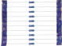
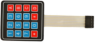
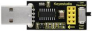
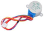
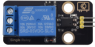
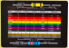
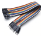
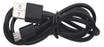

# **Keyestudio Raspberry Pi Pico Learning Kit Complete Edition**

### Lead-in

Do you want to learn about programming?

As long as you are passionate about science and dare to explore new things, this kit is surely the best choice for you.

The kit is a learning kit for two programming methods, including Thonny, MicroPython IDE and Arduino IDE.  you can create numerous fascinating experiments with the Raspberry pi, sensors, modules and electronic components. 

Tutorials are provided, which contain detailed wiring diagrams, component knowledge, test code, and so on. 

In addition, you can master the use of electronics, physics, science and programming by building up experiment with this kit.

### **Kit List**

|                   NAME                   | QTY  |                             PIC                              |
| :--------------------------------------: | :--: | :----------------------------------------------------------: |
|            Raspberry Pi Pico             |  1   |  |
|                 Blue LED                 |  10  |  |
|                 Red LED                  |  10  |  |
|                Yellow LED                |  10  |  |
|                Green LED                 |  10  |  |
|                   RGB                    |  1   |  |
|              220Ω Resistor               |  10  |  |
|              10KΩ Resistor               |  10  |  |
|               1KΩ Resistor               |  10  |  |
|    Raspberry Pi Pico Expansion Board     |  1   |  |
|            10KΩ Potentiometer            |  1   |  |
|              Active Buzzer               |  1   |  |
|              Passive Buzzer              |  1   |  |
|                  Button                  |  4   |  |
|               Tilt Switch                |  1   |  |
|              Photoresistor               |  2   |  |
|               Flame Sensor               |  1   |  |
|                Yellow Cap                |  4   |  |
|               IC 74HC595N                |  1   |  |
|        ESP8266 Serial WiFi ESP-01        |  1   |  |
|           1-Digit Tube Display           |  1   |  |
|           4-Digit Tube Display           |  1   |  |
|          8*8 Dot Matrix Display          |  1   |  |
|     Temperature and Humidity Sensor      |  1   |  |
|              LCD_128X32_DOT              |  1   |  |
|               IR Receiver                |  1   |  |
|           IR Remote Controller           |  1   |  |
|                  Servo                   |  1   |  |
|           4*4 Membrane Keypad            |  1   |  |
|                 IC L293D                 |  1   |                                        |
| USB to ESP-01S WiFi Module Serial Shield |  1   |  |
|        Stepper Motor Driver Board        |  1   |  |
|              Stepper Motor               |  1   |  |
|             Joystick Module              |  1   |  |
|             5V Relay Module              |  1   |  |
|            PIR Motion Sensor             |  1   |  |
|          10CM M-F Dupont Wires           |  10  |  |
|            Ultrasonic Sensor             |  1   |  |
|             10KΩ Thermistor              |  1   |  |
|             F-F Dupont Wire              |  40  |  |
|             Resistance Card              |  1   |  |
|               Jumper Wire                |  30  |  |
|             M-F Dupont Wire              |  40  |  |
|                Breadboard                |  1   |  |
|                USB Cable                 |  1   |  |
|                   Fan                    |  1   |  |
|                 DC Motor                 |  1   |  |

### **Catalogue**

| Project      |                            |
| ------------ | -------------------------- |
| Project 01:  | Hello World                |
| Project 02:  | Onboard LED flashing       |
| Project 03:  | External LED flashing      |
| Project 04:  | Breathing Led              |
| Project 05:  | Traffic Lights             |
| Project 06:  | RGB LED                    |
| Project 07:  | Flowing Water Light        |
| Project 08:  | 1-Digit Digital Tube       |
| Project 09:  | 4-Digit Digital Tube       |
| Project 10:  | 8×8 Dot-matrix Display     |
| Project 11:  | 74HC595N Control 8 LEDs    |
| Project 12:  | Active Buzzer              |
| Project 13:  | Passive Buzzer             |
| Project 14:  | Mini Table Lamp            |
| Project 15:  | Tilt And LED               |
| Project 16:  | Burglar Alarm              |
| Project 17:  | I2C 128×32 LCD             |
| Project 18:  | Small Fan                  |
| Project 19:  | Servo Sweep                |
| Project 20:  | Stepping Motor             |
| Project 21:  | Relay                      |
| Project 22:  | Dimming Light              |
| Project 23:  | Flame Alarm                |
| Project 24:  | Night Lamp                 |
| Project 25:  | Human Induction Lamp       |
| Project 26:  | Rocker control light       |
| Project 27:  | Temperature Humidity Meter |
| Project 328: | Ultrasonic Ranger          |
| Project 29:  | Temperature Instrument     |
| Project 30:  | Keypad Door                |
| Project 31:  | IR Control Sound and LED   |
| Project 32:  | WiFi Test                  |
| Project 33:  | WiFi Smart Home            |
